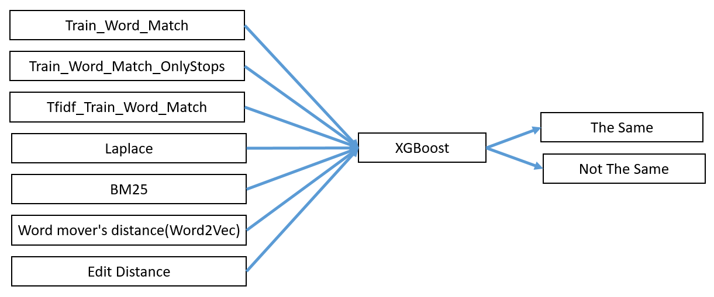

# Data
data file you can directly get from [Kaggle](https://www.kaggle.com/c/quora-question-pairs).

# Target: 
Help Quora to distinguish if two question sentences share the same meaning.

# Framework: XGBoost

# Difficulty: 
* Feature Selection: I haven’t learned the whole framwork of deep learning this time, so it was a hard time for me to select good feature. 
* Application of Word2vec model: It is quite difficult to apply word2vec model to a sentence because it bases on words not sentences. As a result, I still had a hard time to find the vector of a sentence.

# Solution: 
* Feature Selection: Use word2vec model. 
I tried all models that can be used to evaulate the similarity or distance between two nature language sentences as features. The performance, however, is still not so satisfied. Then I trained a word2vec model using wikipedia database by myself. And try to apply this model on this issue, then I encounter the next difficulty.
* Application of Word2vec model: Use Word mover distance(WMD) model.
I do research in this issue and browse through several papers. However,  the conclusion I got is that it is still a very valuable reasearch topic. Therefore, instead of finding a vector of a sentence, I use WMD model to recursively find couples of words in both sentence which have most close vector in word2vec model, then calculate the average of distance of all couples of close words.

# Result: 
* Leader Board 1369/3307
* LogLoss: 0.34

